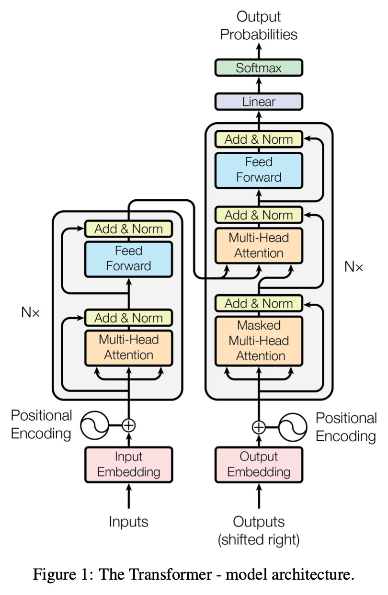
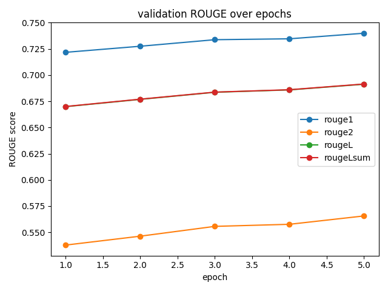
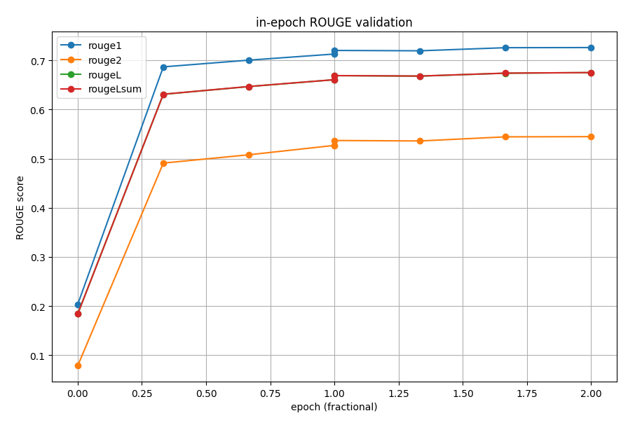

# FLAN-T5 + LoRA for Layperson Radiology Summarisation

This project fine-tunes **FLAN-T5-base** with **LoRA** adapters on the **BioLaySumm 2025 LaymanRRG** dataset.  
Given a radiology report, the model generates a 1–3 sentence summary in plain English that replaces medical jargon with basic concepts.


## 1. Problem Description

Radiology reports are written for clinicians and are difficult for patients to understand.  
The goal of this project is to:

- take an **expert radiology report** as input,  
- produce a **short layperson-friendly summary**,  
- evaluate performance using **ROUGE**,  
- and analyse where the model succeeds/fails.

We use a pretrained FLAN-T5-base model with LoRA adapters to efficiently fine-tune on an RTX 5070 TI (16GB)

## 2. Background

<div style="float: right; margin-left: 20px;">
  
</div>

<br>
FLAN-T5 is a variant of Google's T5 that has been instruction-tuned on a large number of diverse tasks. Whilst the original T5 was already a strong encoder-decoder transformer, FLAN-T5 is trained specifically to follow natural language instructions, making it more suitable at tasks phrased as "Rewrite this", "Summarise", or "Explain this".

### Encoder/Decoder Architecture

FLAN-T5 uses the classic seq2seq structure:
- The encoder reads the input radiology report (plus our instruction prompt) and converts it into hidden representations.
- The decoder takes those representations and generates the summary token by token, handling both:
  - the encoder's information (what the report says)
  - previous generated tokens (what has already been written by the model)

FLAN-T5 is also relatively accessible compared to more complex LLMs, which require more VRAM to fine-tune.

### LoRA (Low-Rank Adaptation)

FLAN-T5-base has ~**250M** parameters. Fully fine tuning all of them on a single consumer GPU is both slow and unneccesary.

**LoRA** adds a tiny number of trainable matrices inside the model's attention layers. Only these low-rank matrices are updated during training, which was around **1.7M parameters** in our configuration.

Effectively, **FLAN-T5** provides general reasoning ability and **LoRA** teaches it the domain-specific phrasing of radiology summaries.

### ROUGE Scores

To evaluate the quality of generated summaries, we use the ROUGE (Recall-Oriented Understudy for Gisting Evaluation) metric suite. ROUGE measures the degree of overlap between our model's output and the gold layman summary. The four relevant variants are:

- **ROUGE-1** — unigram (word-level) overlap  
  Reflects whether the model captures the key medical terms and concepts.

- **ROUGE-2** — bigram (two-word sequence) overlap  
  Measures phrasing quality and short-range coherence.

- **ROUGE-L** — longest common subsequence  
  Rewards structurally similar summaries (e.g. similar sentence ordering).

- **ROUGE-Lsum** — a variant of ROUGE-L suited to multi-sentence summaries.  
  This is typically the most representative single metric for summarisation and is used as our primary score for hyperparameter tuning.


## 3. Code Structure

`dataset.py` – Dataset handler with an optional 90:10 test split  
`eval.py` – Produces CSVs & plots using metrics logged from train.py  
`modules.py` – Model & tokenizer definition  
`predict.py` – Uses best checkpoint to summarise arbitrary reports  
`train.py` – Full training algorithm with logged metrics  
`runs/` – Stores model checkpoints + loss & validation history  
`eval/` – Stores CSVs & plots generated from history in `runs/`

### Dependencies
- **torch** – `2.9.0`  
- **transformers** – `4.57.1`  
- **datasets** – `4.4.1`  
- **evaluate** – `0.4.6`  
- **peft** – `0.17.1`  
- **sentencepiece** – `0.2.1`  
- **numpy** – `2.3.3`  
- **matplotlib** – `3.10.7`  
- **tqdm** – `4.67.1`


## 4. Usage
It is quite easy to install and train the model using the given requirements.txt file. 

**NOTE:** This was only tested in WSL, which requires a very specific setup for CUDA & torch.
```
# Create a conda environment & install
conda create -n COMP3710 python=3.11
conda activate COMP3710
pip install -r requirements.txt

# Run training using default parameters
python train.py --out_dir runs/flan_t5_lora

# Generate plots & CSVs
python eval.py runs/flan_t5_lora

# Test the model, optionally specifying the report index in the dataset
python predict.py --ckpt runs/flan_t5_lora --idx [report_index]
```
## 5. Dataset
### 5.1 Source
**Dataset:** `BioLaySumm/BioLaySumm2025-LaymanRRG-opensource-track` (Hugging Face)

Each row contains:

- x:  `radiology_report` – the original expert report (input).
- y:  `layman_report` – the corresponding layperson summary (target).

### 5.2 Splits
The dataset provides the following splits by default:
- `train`, 
- `validation`
- `test`* 

However, the `test` split is not useful for evaluation as it omits layman summaries. Hence, we optionally compute a `90:10` `train:test` split for hyperparameter tuning. A 10% hold-out is sufficient given the large dataset size, and avoids unneccesary computation during evaluation.

The final evaluation uses the `validation` set by default, which remains untouched by our splits. This fixed validation set avoids the noise from random partitioning and ensures that final results are comparable and reproducable. 

### 5.3 Prompts & Preprocessing

Minimal preprocessing was applied. We justify this as directly modifying the text may reduce our model's real-world performance, as we want our model to be robust to real clinical noise. We let FLAN-T5 handle and model any inconcistencies in language.

Each input is embedded into a fixed instruction prompt:
```
You are a helpful medical assistant. Rewrite the radiology report for a layperson
in 1–3 sentences, avoid jargon, use plain language.

Report:
{radiology_report}

Layperson summary:
```
- Inputs are tokenised and truncated to `max_input_len` (default 1024)
- Targets are tokenised and truncated to `max_target_len` (default 256)

No additional cleaning or filtering is performed.

## 6. Model & Training

At a high level, training follows a standard seq2seq fine-tuning loop implemented in PyTorch. Each radiology report is first wrapped in our instruction prompt and tokenised, along with its lay summary as the target. We then run a forward pass through FLAN-T5 with LoRA adapters, compute the cross-entropy loss over the summary tokens, and use gradient accumulation so that several small batches simulate a larger effective batch size. Every `grad_accum` steps we update only the LoRA parameters with AdamW.


### 6.1 Base Model & LoRA Config

- Base model: **google/flan-t5-base** (~249M parameters)
- LoRA applied to: `["q", "k", "v", "o"]`
- LoRA configuration:
  - `r = 8`  
  - `alpha = 16`  
  - `dropout = 0.05`


Total trainable parameters under LoRA: **~1.7M**.


### 6.2 Default Arguments
The training script contains many command line arguments to control model setup, optimisation, and LoRA configuration.  
Defaults were chosen to contain VRAM usage to 16GB. 

| Argument | Default | Description |
|---------|---------|-------------|
| `--model_name` | `"google/flan-t5-base"` | Base HuggingFace model to load adapters. |
| `--out_dir` | `"runs/flan_t5_lora"` | Directory where checkpoints, logs, and metrics are saved. |
| `--epochs` | `5` | Total number of epochs. |
| `--lr` | `2e-4` | Learning rate for AdamW |
| `--wd` | `0.01` | Weight decay regularisation|
| `--warmup_steps` | `500` | Gradual warmup for the learning rate scheduler |
| `--batch_size` | `2` | Batch size. Small due to VRAM constraints. |
| `--grad_accum` | `8` | Number of gradient accumulation steps. Effective batch size = `batch_size × grad_accum`. |
| `--max_input_len` | `1024` | Maximum token length for the radiology report + prompt. Inputs are truncated beyond this length. |
| `--max_target_len` | `256` | Maximum token length for model output. |
| `--val_beams` | `4` | Beam search width during validation generation. Improves ROUGE at the cost of speed. |
| `--val_max_new_tokens` | `128` | Maximum generation length for validation summaries. |
| `--lora_r` | `8` | LoRA rank. Controls the size of the low-rank adaptation matrices. |
| `--lora_alpha` | `16` | LoRA scaling factor, effectively adjusting update magnitude. |
| `--lora_dropout` | `0.05` | Dropout applied to LoRA layers to improve generalisation. |
| `--seed` | `1337` | Global seed for reproducibility. |
| `--fp16` | *off by default* | Enables mixed precision training. |

### 6.3 Hardware

- `GPU`: RTX 5070 TI
- `VRAM`: 16GB

VRAM usage generally hovered around 15.4GB during training.

## 7. Results

We run training over all 150k rows across 5 epochs, using the default parameters as defined above. As said above, evaluation was executed against the default validation set.

### 7.1 Training Loss


The training loss curve shows a steep drop during the first ~2,000 steps, indicating that the model rapidly learns the relationship between reports and their summaries. This is not a suprise, considering the richness of each epoch. After this convergence, however, we begin to see diminishing returns, with loss slowly decreasing. This reflects smaller refinements to phrasing and style. 

Note that the periodic spikes at the start of each epoch are an artefact of gradient accumulation rather than training instability. Because the model accumulates gradients for several batches before performing the first optimiser step, it computes loss using weights that have not yet been updated. As a result, the logged loss appears higher during these early batches and then drops quickly once the first few updates occur. 

### 7.2 Validation

#### Full-Val: 5 Epochs


| Epoch | ROUGE-1 | ROUGE-2 | ROUGE-L | ROUGE-Lsum |
|-------|---------|---------|---------|------------|
| 1 | 0.722 | 0.538 | 0.670 | 0.670 |
| 2 | 0.728 | 0.546 | 0.677 | 0.677 |
| 3 | 0.734 | 0.556 | 0.684 | 0.684 |
| 4 | 0.735 | 0.558 | 0.686 | 0.686 |
| 5 | **0.740** | **0.566** | **0.691** | **0.692** |

ROUGE scores increase steadily across the five epochs, but the improvements are modest and nearly flat. As suggested by our loss curve, the majority of learning actually happens within the first epoch, and by the time full-epoch validation begins, the model is already close to its optimal performance. The remaining epochs provide incremental refinements rather than substantive gains, indicating that the model has largely converged by the end of epoch 1.

Although all ROUGE metrics follow the same trajectory, they improve at slightly different rates. ROUGE-1 and ROUGE-L/Lsum rise quickly and stabilise early, indicating that that the model rapidly learns to identify key clinical concepts and sentence structure. ROUGE-2, however improves slightly slower, reflecting that the model continues refining phrasing and short n-gram coherence even after the semantic mapping is learned. 

The best checkpoint achieves:
- `ROUGE-Lsum` ≈ 0.6915


#### Multi-Val: 2 Epochs

 

To make this behaviour clearer, we also trained the model for two epochs while performing four validation checks per epoch. This finer-grained view reveals a sharp jump in ROUGE by the first epoch evaluation (around 25% through epoch 1), confirming that most of the performance gain occurs very early in training. After this point, the curves flatten noticeably, showing that later updates provide only small refinements.

### 7.3 Training Report


This section summarises the key training settings, LoRA configuration, model size, and hardware used for fine-tuning FLAN-T5-base. Training took an average of 2-2.5 hours per epoch.

### Training Configuration

| Setting | Value |
|--------|-------|
| **Model** | google/flan-t5-base |
| **Total Params** | 251,116,800 |
| **Trainable (LoRA)** | 1,769,472 |
| **LoRA** | r = 8, α = 16, dropout = 0.05 |
| **GPU** | RTX 5070 Ti (15.9 GB VRAM) |
| **Epochs** | 5 |
| **Batch Size** | 2 |
| **Grad Accum** | 8 |
| **Warmup Steps** | 1000 |
| **Learning Rate** | 2e-4 |
| **Weight Decay** | 0.01 |
| **Total Training Time** | ~39,982 s (~11.1 h) |


## 8. Error Analysis


### Error Analysis Samples

| Analysis | Radiology Report | Gold Summary | Model Prediction |
|---------|------------------|--------------|------------------|
| **Success: Strong match** | The chest shows significant air trapping. Bilateral apical chronic changes are present. Dorsal kyphosis is noted. No evidence of pneumothorax. | The chest shows a large amount of trapped air. There are long-term changes at the top of both lungs. The upper back is curved outward. There is no sign of air in the space around the lungs. | The chest x-ray shows a lot of trapped air in the lungs. There are long-term changes at the top of both lungs. The upper back is curved more than it should be. There's no sign of air in the chest cavity. |
| **Success: Fully correct** | No parenchymal consolidation or peribronchial thickening is observed, with no significant changes in the lower lobe. | There is no sign of lung tissue thickening or thickening around the airways in the lower part of the lung, and there are no major changes in this area. | No signs of lung tissue consolidation or thickening around the airways are seen, and there are no significant changes in the lower part of the lung. |
| **Failure: subtle semantic error (misinterprets “pneumothorax”)** | Comparison with the previous examination dated 20 03 2010 shows slightly greater expansion of the right lung compared to the prior control. Persistent right apical pneumothorax. A pleural drainage tube is present in the right mid-lung field. Subcutaneous emphysema is noted. | Looking at the images from the chest compared to the ones taken on March 20, 2010, we can see that the right lung has expanded a bit more than before. There's still a small amount of air leaking around the lung on the right side. There's a tube in the middle of the right lung to help drain fluid. There's also a bit of air trapped under the skin. | Compared to the previous exam from March 20, 2010, the right lung is a bit larger than it was before. There's still a collapsed lung at the top of the right lung. A tube is in place to drain fluid from the lungs in the middle of the right lung. There's also air under the skin. |
| **Failure: technically correct but too clincial** | Midline sternotomy with cerclage. Hiatal hernia. Chronic parenchymal lung changes. Bilateral chronic pleural thickening. No pulmonary infiltrate suggestive of pneumonia identified. | There is a surgical cut down the middle of the chest with a wire loop used to close it. There is a hernia at the diaphragm opening. The lungs show long-term damage. Both sides of the lungs have chronic thickening of the lining. No signs of pneumonia are seen in the lungs. | A midline sternotomy with cerclage is present. Hiatal hernia is present. There are chronic changes in the lung tissue. There is ongoing thickening of the pleura on both sides. No signs of pneumonia are found. |

Across the selected examples, two broad failure modes emerge:
1. `Overly Clinical Language`

In the 4th sample, the model produces a summary that is technically accurate but fails to fully simplify it. Instead of paraphrasing jargon such as “sternotomy”, “cerclage”, and “pleura”, it repeats these clinical terms almost unchanged. This behaviour appears when the input consists of a dense cluster of specialised terms with no surrounding context. Each sentence in the report is essentially a list of named medical findings rather than descriptions of processes or effects. This is a concept-mapping failure caused by the structure of the input. In general, the model performs well when it can see *why* a clinical entity is mentioned (e.g. "pneumothorax in the upper right lobe"). Sequence models rely heavily on context windows, relational cues and patterns, but when the report is simply a stack of nouns, the model struggles under a lack of signal / context needed to rewrite the medical terms.

2. `Semantic Drift on Rare Clinical Patterns`

We can observe a hallucination issue on the 3rd sample. The model incorrectly describes a 'persistent apical pneumothorax' as a 'collapsed lung', which is somewhat related but not medically equivalent. This suggests that the model occasionally substitutes a more familiar medical concept when faced with highly specific terms. These errors tend to be small, but they directly affect factual correctness.


Despite these issues, the model shows strong reliability across most cases, especially when the input phrasing is common in the training corpus. The model seldom invents findings, avoids major hallucinations, and generally preserves clinical meaning. However, failures do occur when the input consists largely of isolated, highly specific medical terms with no explanatation. For instance, phrases such as "persistent right apical pneumothorax." or "hiatal hernia" provide little contextual structure for the model to interpret. In these cases, the model either repeats the terms verbatim rather than simplifying, or substitutes to a basic concept that may not be medically equivalent.


